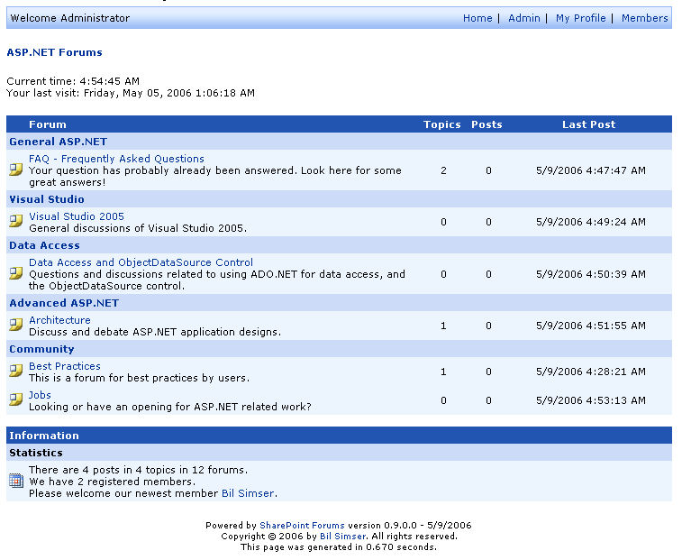

## Welcome to the SharePoint Forums Project
The SharePoint Forums is a free, open source, single web part that provides a more feature rich discussion board for SharePoint based sites.

[SharePoint Forums CodePlex page](http://www.codeplex.com/SPFORUMS)
[SharePoint Forums RoadMap](RoadMap)

**Related links**
[SharePoint Forums Blog](http://weblogs.asp.net/bsimser/archive/tags/SharePoint+Forums/default.aspx)
[Online Documentation](http://www.codeplex.com/SPFORUMS/Wiki/View.aspx?title=SharePoint%20Forums%20Documentation&referringTitle=Home)
[Discussion Forums](http://www.codeplex.com/SPFORUMS/Thread/List.aspx)
[Issue Tracker](http://www.codeplex.com/SPFORUMS/WorkItem/List.aspx)
[Frequently Asked Questions](Frequently-Asked-Questions)
[Current Known Problems](Current-Known-Problems)
[Meet the Team](Meet-the-Team)
[News Feeds](News-Feeds)

For more information about this project please contact [Bil Simser](mailto:emailme@bilsimser.com).